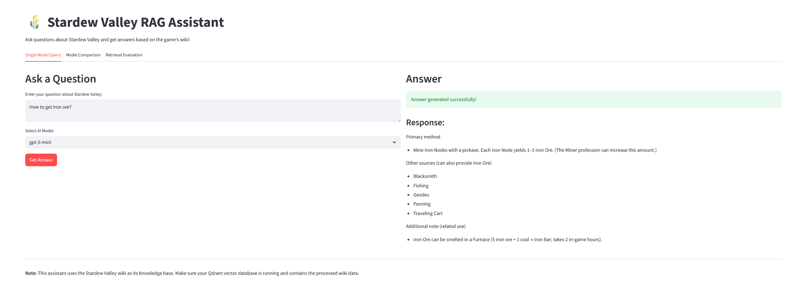
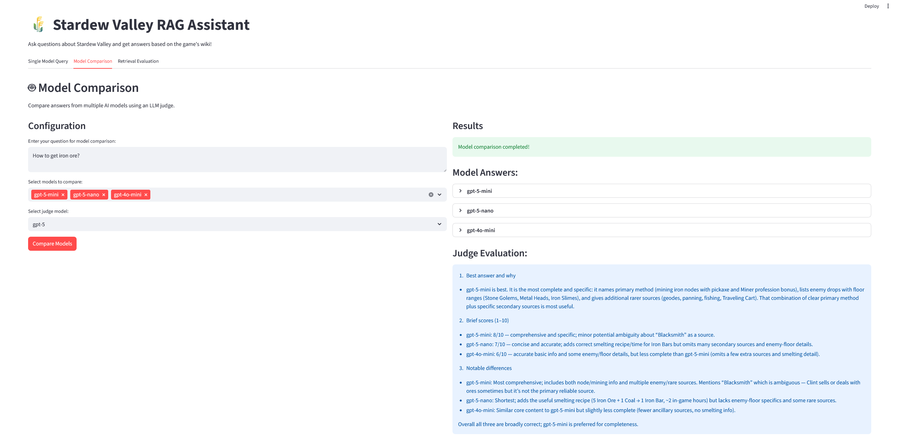
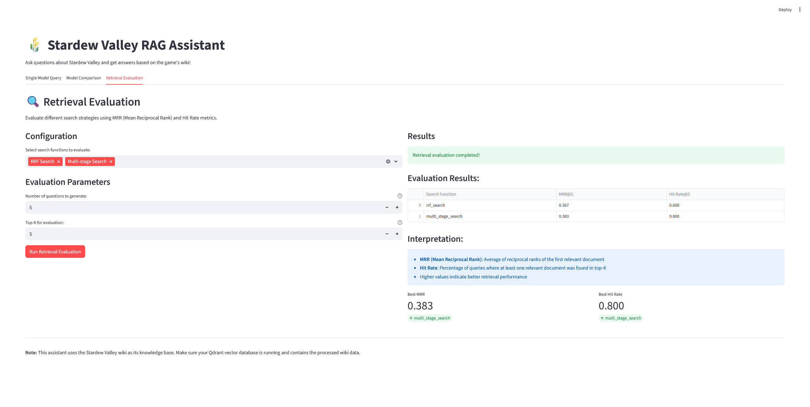

# 🌾 Stardew Valley Farmhand - RAG Assistant

A comprehensive Retrieval-Augmented Generation (RAG) application designed to help Stardew Valley players find accurate information from the game's wiki. This project demonstrates RAG techniques including hybrid search, multiple retrieval strategies, and comprehensive evaluation methodologies.

## 🎯 Problem Description

Stardew Valley is a complex farming simulation game with extensive mechanics, items, relationships, and strategies. Players often need quick access to specific information about:

- **Crop growing seasons and profitability**
- **Fishing locations and techniques** 
- **Mining strategies and ore locations**
- **Relationship building with NPCs**
- **Crafting recipes and materials**
- **Quest completion strategies**

The official [Stardew Valley Wiki](https://stardewvalleywiki.com) contains vast amounts of information, but finding specific answers requires navigating through multiple pages and sections. This RAG application solves this problem by:

1. **Processing and indexing** the entire Stardew Valley wiki into a searchable knowledge base
2. **Providing instant, accurate answers** to player questions using advanced retrieval techniques
3. **Supporting multiple search strategies** (dense vectors, sparse vectors, hybrid search)
4. **Evaluating and optimizing** retrieval and generation quality through comprehensive testing

## 🏗️ Architecture Overview

### Retrieval Flow
The application implements a sophisticated retrieval pipeline that combines:

- **Knowledge Base**: Qdrant vector database containing processed Stardew Valley wiki content
- **Dense Vectors**: Jina AI embeddings (jina-embeddings-v2-small-en) for semantic similarity
- **Sparse Vectors**: BM25 for keyword-based matching
- **Hybrid Search**: Reciprocal Rank Fusion (RRF) combining both approaches
- **LLM Integration**: OpenAI GPT models for answer generation

### Data Processing Pipeline
1. **Web Scraping**: Automated extraction of [Stardew Valley Wiki](https://stardewvalleywiki.com) content
2. **Content Processing**: Text and table summarization using LLMs
3. **Vectorization**: Dual embedding generation (dense + sparse)
4. **Storage**: Qdrant vector database with hybrid search capabilities

## 🔍 Retrieval Evaluation

The project implements comprehensive retrieval evaluation across multiple approaches:

### Multiple Retrieval Strategies
- **Dense Vector Search**: Semantic similarity using Jina embeddings
- **Sparse Vector Search**: BM25 keyword matching
- **Hybrid Search**: RRF fusion of dense and sparse results
- **Multi-stage Search**: Prefetching with re-ranking

### Evaluation Metrics
- **MRR (Mean Reciprocal Rank)**: Measures ranking quality
- **Hit Rate**: Percentage of queries with correct answers in top-k results
- **Automated Question Generation**: LLM-generated evaluation questions from wiki content
- **Comparative Analysis**: Side-by-side evaluation of different retrieval approaches

## 🤖 LLM Evaluation

The application includes sophisticated LLM evaluation capabilities:

### Model Comparison
- **Multiple Model Support**: GPT-5,GPT-5-Mini, GPT-5-Nano, GPT-4o, 
- **Automated Evaluation**: LLM judge comparing model outputs
- **Quality Assessment**: Relevance scoring and explanation generation
- **Performance Metrics**: Comparative analysis of different models

### Evaluation Framework
- **Automated Question Generation**: Creates evaluation questions from knowledge base
- **Multi-model Testing**: Compares answers across different LLM models
- **Judge-based Evaluation**: Uses LLM judges to assess answer quality
- **Relevance Classification**: NON_RELEVANT, PARTLY_RELEVANT, RELEVANT scoring

## 🖥️ User Interface

### Streamlit Web Application
The project features a modern, user-friendly Streamlit interface with:

- **Interactive Query Interface**: Easy-to-use question input
- **Model Selection**: Choose from multiple AI models
- **Real-time Results**: Instant answers with loading indicators
- **Model Comparison Tab**: Side-by-side evaluation of different models
- **Error Handling**: Graceful error messages and troubleshooting guidance

### Features
- Clean, responsive design optimized for user experience
- Multiple model comparison capabilities
- Real-time processing with visual feedback
- Comprehensive error handling and user guidance

## 📊 Ingestion Pipeline

### Automated Data Processing
The project implements a fully automated ingestion pipeline:

- **Web Scraping**: Automated extraction from [Stardew Valley Wiki](https://stardewvalleywiki.com)
- **Content Processing**: LLM-based summarization of text and tables
- **Vector Generation**: Automated embedding creation for both dense and sparse vectors
- **Database Population**: Batch processing and storage in Qdrant

### Detailed Processing Steps

1. **Data Extraction**: We extracted the data from the Stardew Valley Wiki website
2. **HTML Processing**: Used the `unstructured` Python library to partition the HTML files
3. **Content Chunking**: Applied multiple criteria to chunk the content effectively
4. **Content Classification**: Extracted both text and table chunks from the processed data
5. **Table Summarization**: Table chunks were fed into an LLM to generate summaries
6. **Vector Storage**: Summarized content was stored in the vector database for retrieval

### Pipeline Components
- **Data Ingestion Script**: `scripts/data_ingest.py` for automated processing
- **Vector Store Pipeline**: `scripts/vector_store.py` for database setup
- **Batch Processing**: Efficient handling of large datasets
- **Content Type Classification**: Automatic categorization of text vs. table content
- **LLM Summarization**: Automated table summarization using language models

## 📈 Monitoring & Evaluation

### Evaluation Dashboard
- **Retrieval Metrics**: MRR and Hit Rate visualization
- **Model Performance**: Comparative analysis of different LLM models
- **Quality Assessment**: Automated relevance scoring and explanation
- **Statistical Analysis**: Comprehensive evaluation across multiple test cases

## 🐳 Containerization

...


## 🚀 Getting Started

### Prerequisites
- Python 3.8+
- Docker and Docker Compose
- OpenAI API key

### Installation

1. **Clone the repository**:
   ```bash
   git clone https://github.com/Erfan-ghiyasvand/Stardew-RAG-Farmhand
   cd Stardew-Valley-Farmhand
   ```

2. **Set up environment variables**:
   ```bash
   export OPENAI_API_KEY="your-api-key-here"
   ```

3. **Install dependencies**:
   ```bash
   pip install -r requirements.txt
   ```

4. **Start services with Docker Compose**:
   ```bash
   docker-compose up -d
   ```

5. **Run the application**:
   ```bash
   streamlit run app.py
   ```

### Manual Setup (Alternative)

1. **Start Qdrant server**:
   ```bash
   docker run -p 6333:6333 qdrant/qdrant
   ```

2. **Set up the vector database**:
   ```bash
   python scripts/vector_store.py
   ```

3. **Run the Streamlit app**:
   ```bash
   streamlit run app.py
   ```

## 📚 Usage

### Basic Query
1. Open the Streamlit interface
2. Enter your Stardew Valley question
3. Select your preferred AI model
4. Click "Get Answer" for instant results



### Model Comparison
1. Navigate to the "Model Comparison" tab
2. Enter your question
3. Select multiple models to compare
4. Choose a judge model for evaluation
5. Click "Compare Models" for detailed analysis



### Example Queries
- "What crops should I plant in spring for maximum profit?"
- "How do I get iridium ore in the Skull Cavern?"
- "What gifts does Abigail like the most?"
- "How do I unlock the Community Center bundles?"

## 🔧 Best Practices Implementation

### Hybrid Search
- **Dense + Sparse Vectors**: Combines semantic similarity with keyword matching
- **Reciprocal Rank Fusion**: Advanced fusion algorithm for optimal results
- **Multi-stage Retrieval**: Prefetching with intelligent re-ranking

### Document Re-ranking
- **Multi-vector Approach**: Different embedding strategies for different content types
- **Content-aware Ranking**: Specialized handling for text vs. table content
- **Relevance Optimization**: Continuous improvement of ranking algorithms


## 📊 Evaluation Results



### Retrieval Performance
- **MRR@5**: Mean Reciprocal Rank across top-5 results
- **Hit Rate@5**: Percentage of queries with correct answers in top-5
- **Comparative Analysis**: Performance across different retrieval strategies

### LLM Performance
- **Answer Quality**: Relevance scoring across different models
- **Response Time**: Performance optimization for real-time queries
- **Model Comparison**: Comprehensive evaluation of different LLM approaches


## 🙏 Acknowledgments

- **Stardew Valley Wiki** (stardewvalleywiki.com): Comprehensive game information source
- **Qdrant**: Vector database for efficient similarity search
- **OpenAI**: Language models for answer generation
- **Streamlit**: User interface framework
- **[DataTalksClub](https://datatalks.club/)**: For the LLM Zoomcamp course

### Special Thanks

We extend our sincere gratitude to **Alexey Grigorev** and the **DataTalks Club** team for their expert guidance, valuable Slack support, and for creating this exceptional learning opportunity through the LLM course.

We also want to thank the **Qdrant team** for their invaluable support and excellent vector database technology that made this project possible.

## 📄 Data Sources & Licensing

### Stardew Valley Wiki Content
This project uses content from the [Stardew Valley Wiki](https://stardewvalleywiki.com) under the **Creative Commons Attribution-NonCommercial-ShareAlike** license.

**Attribution**: All game information, guides, and data used in this RAG application are sourced from the Stardew Valley Wiki community. The wiki content is available under Creative Commons Attribution-NonCommercial-ShareAlike unless otherwise noted.

**License Compliance**: This project complies with the CC BY-NC-SA license by:
- Providing proper attribution to the Stardew Valley Wiki
- Using the content for educational and non-commercial purposes
- Maintaining the same license terms for any derivative works

**Source**: [Stardew Valley Wiki](https://stardewvalleywiki.com) - Content is available under Creative Commons Attribution-NonCommercial-ShareAlike unless otherwise noted.


**Note**: This project is part of the LLM Zoomcamp course by DataTalksClub and demonstrates advanced RAG techniques for real-world applications.

## 📄 License

This project is licensed under the MIT License - see the LICENSE file for details.
